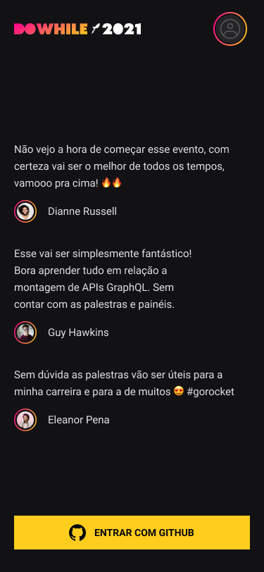
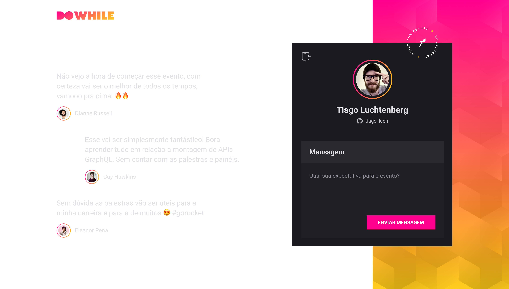

<h1 align="center">
    
</h1>

## 💻 Sobre o projeto

Projeto desenvolvido na missão Impulse do **NLW Heat** oferecida pela [Rocketseat](https://www.rocketseat.com.br/).

DoWhile2021 é uma aplicação onde as pessoas podem compartilhar suas expectativas sobre o evento DoWhile.

## 🎨 Layout

O layout da aplicação está disponível no Figma:

<a href="https://www.figma.com/community/file/1031699316177416916/%5BNLW-Heat---Mission%3A-Impulse%5D-DoWhile2021">
  
</a>

### Mobile

<p align="center">
  
  
</p>

### Web

<p align="center">
  
  
</p>


## 🚀 Como executar o projeto

Este projeto é divido em três partes:
1. Backend (pasta node-heat) 
2. Frontend (pasta web)
3. Mobile (pasta app)

💡Tanto o Frontend quanto o Mobile precisam que o Backend esteja sendo executado para funcionar.

### Pré-requisitos

Antes de começar, você vai precisar configurar o seu ambiente de trabalho:

[Notion com passo a passo](https://efficient-sloth-d85.notion.site/Impulse-240cb588fb8d4089917c7a6cef0008b3)


#### 🎲 Rodando o Backend (servidor)

```bash

# Clone este repositório
$ git clone git@github.com:POliveira29/nlw-heat-DoWhile2021.git

# Acesse a pasta do projeto no terminal/cmd
$ cd nlw-heat-DoWhile2021

# Vá para a pasta server
$ cd node-heat

# Instale as dependências
$ yarn

# Execute a aplicação em modo de desenvolvimento
$ yarn dev

# O servidor inciará na porta:4000 - acesse http://localhost:4000 

```
<p align="center">
  <a href="https://github.com/tgmarinho/README-ecoleta/blob/master/Insomnia_API_Ecoletajson.json" target="_blank"></a>
</p>


#### 🧭 Rodando a aplicação web (Frontend)

```bash

# Clone este repositório
$ git clone git@github.com:POliveira29/nlw-heat-DoWhile2021.git

# Acesse a pasta do projeto no seu terminal/cmd
$ cd nlw-heat-DoWhile2021

# Vá para a pasta da aplicação Front End
$ cd web

# Instale as dependências
$ yarn

# Execute a aplicação em modo de desenvolvimento
$ yarn dev

# A aplicação será aberta na porta:3000 - acesse http://localhost:3000

```

#### 📱 Rodando a aplicação mobile (Frontend)

```bash

# Clone este repositório
$ git clone git@github.com:POliveira29/nlw-heat-DoWhile2021.git

# Acesse a pasta do projeto no seu terminal/cmd
$ cd nlw-heat-DoWhile2021

# Vá para a pasta da aplicação Front End
$ cd app

# Instale as dependências
$ yarn

# Execute a aplicação em modo de desenvolvimento
$ expo start

# Uma aba chamada expo será aberta, com as opções de rodar a aplicação via android ou IOS

```

## 🛠️ Tecnologias

As seguintes ferramentas foram usadas na construção do projeto:

#### **Website**  ([React](https://reactjs.org/)  +  [TypeScript](https://www.typescriptlang.org/))

-   **[React Icons](https://react-icons.github.io/react-icons/)**
-   **[Axios](https://github.com/axios/axios)**

#### [](https://github.com/tgmarinho/Ecoleta#server-nodejs--typescript)**Server**  ([NodeJS](https://nodejs.org/en/)  +  [TypeScript](https://www.typescriptlang.org/))

-   **[Express](https://expressjs.com/)**
-   **[CORS](https://expressjs.com/en/resources/middleware/cors.html)**
-   **[ts-node](https://github.com/TypeStrong/ts-node)**
-   **[dotENV](https://github.com/motdotla/dotenv)**

#### [](https://github.com/tgmarinho/Ecoleta#mobile-react-native--typescript)**Mobile**  ([React Native](http://www.reactnative.com/)  +  [TypeScript](https://www.typescriptlang.org/))

-   **[Expo](https://expo.io/)**
-   **[Expo Google Fonts](https://github.com/expo/google-fonts)**
-   **[React Navigation](https://reactnavigation.org/)**
-   **[React Native SVG](https://github.com/react-native-community/react-native-svg)**
-   **[Axios](https://github.com/axios/axios)**

#### [](https://github.com/tgmarinho/Ecoleta#utilit%C3%A1rios)**Utilitários**

-   Protótipo:  **[NLW Heat - DoWhile 2021](https://www.figma.com/community/file/1031699316177416916)**
-   API:  **[IBGE API](https://servicodados.ibge.gov.br/api/docs/localidades?versao=1)**  →  **[API de UFs](https://servicodados.ibge.gov.br/api/docs/localidades?versao=1#api-UFs-estadosGet)**,  **[API de Municípios](https://servicodados.ibge.gov.br/api/docs/localidades?versao=1#api-Municipios-estadosUFMunicipiosGet)**
-   Editor:  **[Visual Studio Code](https://code.visualstudio.com/)**  → Extensions:  **[SQLite](https://marketplace.visualstudio.com/items?itemName=alexcvzz.vscode-sqlite)**
-   Commit Conventional:  **[Commitlint](https://github.com/conventional-changelog/commitlint)**
-   Teste de API:  **[Insomnia](https://insomnia.rest/)**
-   Ícones:  **[Feather Icons](https://feathericons.com/)**,  **[Font Awesome](https://fontawesome.com/)**
-   Fontes:  **[Ubuntu](https://fonts.google.com/specimen/Ubuntu)**,  **[Roboto](https://fonts.google.com/specimen/Roboto)**


## 📝 Licença

Este projeto esta sobe a licença [MIT](./LICENSE).
